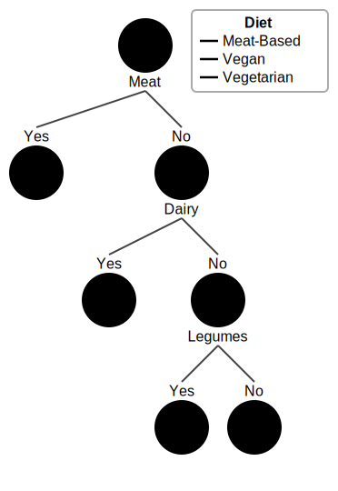

# c-decision-tree: A Pretty Categoral Decision Tree Library
A simple categorial decision tree library for python users, mainly focused at educators and students. The syntax is very similar to scikit learn and it has built-in visualization.


## Features
- Creates an entropy-based decision tree
- Pre-pruning using `min_instances`, `max_depth`, `min_gain`
- Supports lists/`np.array`s of instances as well as `pandas.DataFrame`
- Built-in Visualization
  - IPython Notebook Support
  - Seaborn color palettes support

## Dependencies

### Soft Dependencies
- `seaborn >= 0.11.2`, only needed to access seaborn's color palettes

# Usage Example

In this example, we are going to generate a decisiontree that classifies all dishes in the following dataframe `df` into the categories Vegan, Vegetarian, and Meat-Based.
<details><summary>Click to show the Dataframe</summary>

|    | Name                     | Dairy   | Meat   | Eggs   | Vegetables   | Fruits   | Legumes   | Diet       |
|---:|:-------------------------|:--------|:-------|:-------|:-------------|:---------|:----------|:-----------|
|  0 | Margherita Pizza         | Yes     | No     | No     | Yes          | No       | No        | Vegetarian |
|  1 | Grilled Chicken Salad    | No      | Yes    | No     | Yes          | No       | No        | Meat-Based |
|  2 | Lentil Soup              | No      | No     | No     | Yes          | No       | Yes       | Vegan      |
|  3 | Cheese Omelette          | Yes     | No     | Yes    | No           | No       | No        | Vegetarian |
|  4 | Veggieburger             | No      | No     | No     | Yes          | No       | Yes       | Vegan      |
|  5 | Beef and Bean Burrito    | Yes     | Yes    | No     | Yes          | No       | Yes       | Meat-Based |
|  6 | Falafel                  | No      | No     | No     | Yes          | No       | Yes       | Vegan      |
|  7 | Fruit Salad              | No      | No     | No     | No           | Yes      | No        | Vegan      |
|  8 | Greek Salad              | Yes     | No     | No     | Yes          | No       | No        | Vegetarian |
|  9 | Vegetable Curry          | No      | No     | No     | Yes          | Yes      | No        | Vegan      |
| 10 | Egg Fried Rice           | No      | No     | Yes    | Yes          | No       | No        | Vegetarian |
| 11 | Scrambled Tofu           | No      | No     | No     | No           | No       | Yes       | Vegan      |
| 12 | Tofu Stir Fry            | No      | No     | No     | Yes          | No       | Yes       | Vegan      |
</details>

## Setup
First, we import and initialize the decision tree

```python
from c_DecisionTree import DecisionTree
dt = DecisionTree()
```

Next, fit the decision tree by calling the `fit` function with the DataFrame and the target column `"Diet"` as arguments. Make sure that unique identifiers are excluded from the columns.

```python
dt.fit(data=df.loc[:, df.columns != "Name"], target="Diet")
```
This will create the following decision tree:


Alternatively, you could pass a list of instances to `X` and a list of labels to `y`, just as seen as in scikit learn. The instances in `X` would then just be a list of feature values. In this case, you have to make sure that the order of your features doesn't change. 

## Visualization

All examples show a SVG of the decision tree. Let us look at what each part of the visualization stands for.

Each node displays the **number of instances** in the middle. Around it one can see the **relative frequencies** of each label in the node. The outermost border is displayed in the color of the **majority vote** of labels at node. 

To display the tree `dt` in a jupyter notebook, simply write this as the last line of a cell:

```python
dt
```

Jupyter always displays whatever the last line of a cell returns, or in this case the decision tree's SVG representation. You should now see something like this:


This tree looks a bit different than the examples so far. The colors for Vegan and Vegetarian are swapped. As a vegan diet is often seen as more environmentally friendly, it can make sense to swap them back. This can easily be done by **changing the palette**. To this end, simply call the `set_palette` function:

```python
from c_DecisionTree import set_palette
set_palette(['hsl(25, 67%, 61%)', 'hsl(83, 67%, 61%)', 'hsl(234, 67%, 61%)'])
```

If you now redraw the tree, it should have the colors swapped in the same way as seen in the other examples.

The palette can be changed in 3 ways
- Set back to Default: `set_palette(None)`
- Use a custom palette: `set_palette(list)`
  - The `list` should contain colors as strings that are understandable to an SVG parser. For example `"#55443F"`, `"rgb(255,20,70)"`, or `"hsl(25, 67%, 61%)"`
- Use a seaborn palette: `set_palette(name)`
  - For example `set_palette("muted")`
## Inference
Now, we want to classify a dish that is not in our dataset. 
|    | Name                     | Dairy   | Meat   | Eggs   | Vegetables   | Fruits   | Legumes   |
|---:|:-------------------------|:--------|:-------|:-------|:-------------|:---------|:----------|
|  | Shrimp and Avocado Salad | No      | Yes    | No     | Yes          | No       | No        |

This can simply be done by passing the dataframe containing this instance to the `predict` function of the tree. Assuming that our new instance is in the dataset `instances`, it would look like this:

```python
dt.predict(data=instances)
```

This then returns the list `['Meat-Based']`. It classified our dish correctly!

Again, you could alternatively just pass a list of instances to `X`, as one would do in scikit learn, but you would have to make sure that the sorting is the same as the list that was used to create the tree. You can check the order using `dt.feature_names`.
## Pre-Pruning
This decision tree is technically very correct, but the split on eggs only has one instance in the "Yes" option. By changing the parameters of the decision tree, one can make use of pre-pruning. Depending on the task, this can improve generalization performance. There are currently 3 parameters:
- `min_instances`: A split can only be made if all children contain at least this many instances.
- `min_gain`: A split can only be made if the split would reduce the entropy of this node by this amount.
- `max_depth`: Only allows splits up to this depth. For `max_depth=2`, the tree in the above example would have one split less.

As an example, we decide to only allow a split if all children have at least 2 instances.



In our example, this performs worse. In practice however, this can lead to decision trees that generalize better.